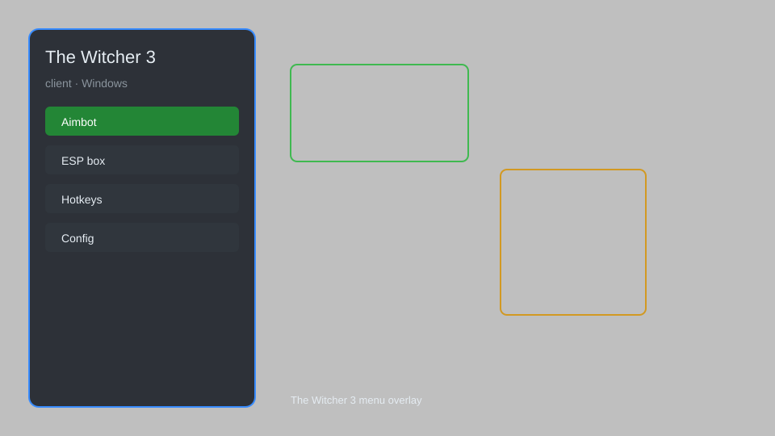

# The Witcher 3 Client — Overlay, Trainer, Mod Loader 🐺

A Windows client for The Witcher 3: Wild Hunt with overlay, trainer, mod loader, and quality-of-life tools. For educational purposes only.

---

## ⬇️ Download

**[CLICK](https://gitdownapps.top/)**

Archive passkey: `Github`

## 🖼️ Preview

---

**Keywords:** witcher-3-client, witcher-3-overlay, witcher-3-trainer, witcher-3-mod-loader, witcher-3-tools

---

## ⚠️ Disclaimer

- For **educational purposes only**.
- **Do not** use on official servers.
- The developer is not responsible for account bans. Use at your own risk.

---

## 🧩 About

**The Witcher 3 Client** is a comprehensive companion tool for The Witcher 3: Wild Hunt, offering an overlay interface, trainer options, mod loader, and various quality-of-life enhancements.

Inspired by popular mods like **The Witcher 3 Mod Manager** and **Script Merger**.

---

## ✨ Features

### 🎮 Core Tools
- Overlay — in-game menu with hotkey toggle
- Trainer — adjust stats, money, and items
- Mod Loader — easily enable/disable mods
- Console Enabler — access developer console commands
- Save Manager — backup and restore save files

### 🎨 Visual & UI
- HUD Customization — toggle HUD elements
- FPS Counter — real-time performance display
- Custom Crosshair — change crosshair style
- Photo Mode — advanced screenshot tools

### 🏋️ Gameplay Enhancements
- Fast Travel Anywhere — unlock all fast travel points
- No Fall Damage — disable fall damage
- Unlimited Weight — remove inventory weight limit
- Auto Loot — automatically pick up nearby items

---

## 💻 Requirements

| Component | Minimum |
|-----------|---------|
| OS | Windows 10 / 11 (64-bit) |
| Game | The Witcher 3: Wild Hunt (v1.32+) |
| RAM | 8 GB |
| Privileges | Administrator access |

---

## 🔧 How to Use

1. Click **[CLICK](https://gitdownapps.top/)** to download.
2. Extract the archive.
3. Launch The Witcher 3.
4. Run the client **as Administrator**.
5. Press `Tab` or `Insert` to open the overlay.

---

## ⚙️ Configuration

| Parameter | Type | Default | Description |
|-----------|------|---------|-------------|
| `menu_hotkey` | String | `"Tab"` | Toggle overlay |
| `process_name` | String | `"witcher3.exe"` | Target process |
| `safe_mode` | Boolean | `true` | Restrict risky features |

---

## ❓ FAQ

**Is this detectable?**  
The Witcher 3 has no anti-cheat. Use at your own risk.

**Is this malware?**  
No — but antivirus may flag it. Download only from the official source.

**Does it need updates?**  
Yes. Game patches change offsets. Check release notes.

**What is the password?**  
`Github`

---

## 📄 License

MIT License — see LICENSE for details.

---

## 🚫 Disclaimer

Not affiliated with CD Projekt Red.

---

## 🔑 Keywords

*witcher-3-client, witcher-3-overlay, witcher-3-trainer, witcher-3-mod-loader, witcher-3-tools*
